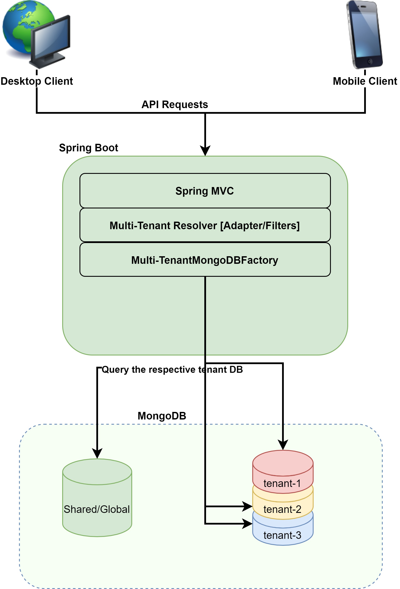
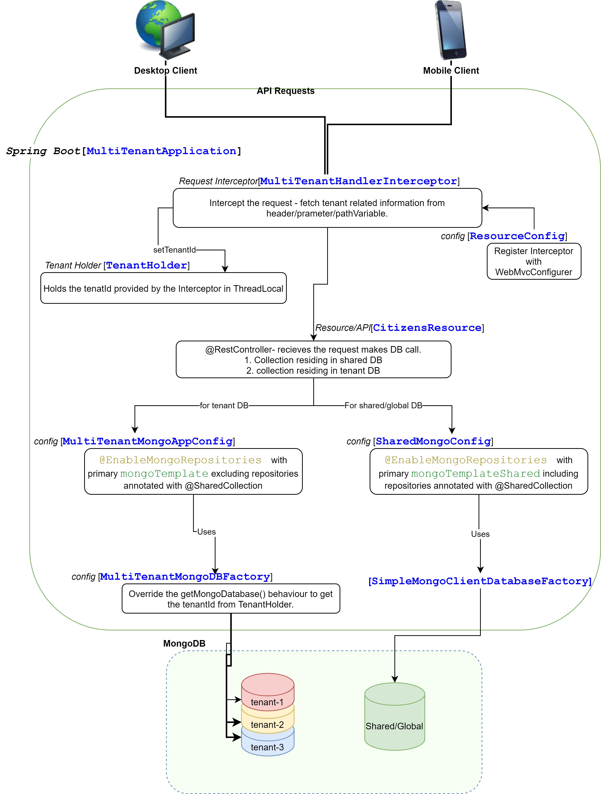

# multitenant-spring-mongodb
##Full featured multi-tenant/tenancy with Spring Boot + MongoDB + Spring MVC

###BLOG on this repo, that will help to understand the code.
https://arun2pratap.medium.com/full-featured-multi-tenant-tenancy-with-spring-boot-mongodb-spring-mvc-f00c98a9df70 

####Diagram showing flow/classes/config/beans with necessary description.

